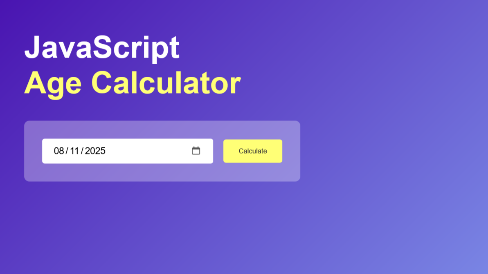
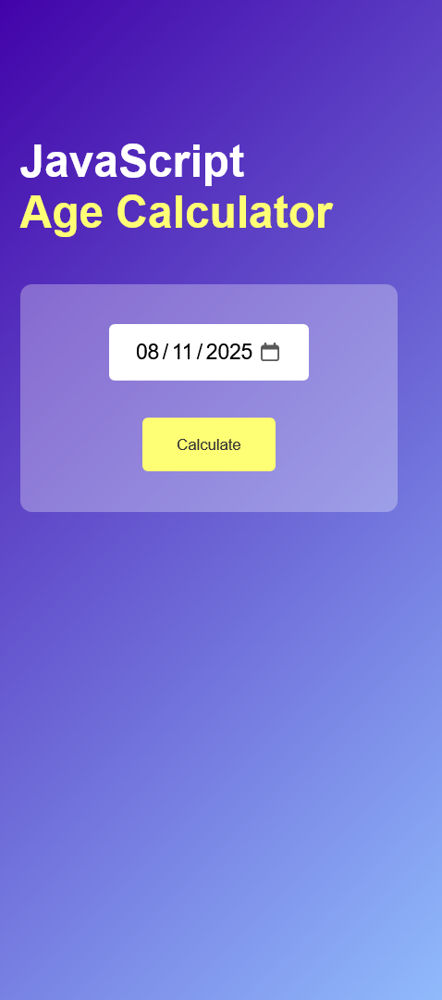

# 05/30 - Notes App

This is a solution to the [QUIZ APP](./index.html).
This is the third project of 30day project challenge.

## Table of contents

- [Overview](#overview)

  - [The challenge](#the-challenge)
  - [Screenshot](#screenshot)
  - [Links](#links)

- [My process](#my-process)

  - [Built with](#built-with)
  - [What I learned](#what-i-learned)
  - [Continued development](#continued-development)

- [Author](#author)
- [Acknowledgments](#acknowledgments)

---

## Overview

### The challenge

Users should be able to:

- Choose one option among 4.
- View correct option even after choosing a wrong answer.

### Screenshot

#### Desktop Design



#### Mobile Design



### Links

- **Solution URL:** [https://github.com/javascript/age-calculator/](https://github.com/javascript/age-calculator/)
- **Live Site URL:** [https://ftsomesh.github.io/javascript/age-calculator/index.html]([https://ftsomesh.github.io/javascript/age-calculator/index.html)

---

## My process

### Built with

- **Semantic HTML5** markup
- **CSS custom properties**
- **Desktop-first** workflow
- **JavaScript Date()** module.

---

### What I learned

This project helped me strengthen my understanding of **Date()** and **basic calculation to find difference in dates**.

Some specific learnings include:

```css
/* We can modify indicator of date input using -webkit-calendar-picker-indicator. But tbh it doesn't work with mobile and some other browswers include firefox.*/
.input-box input[type="date"]::-webkit-calendar-picker-indicator {
    inset: 0;
    width: auto;
    height: auto;
    position: absolute;
    background-position: calc(100% - 10px);
    background-size: 30px;
    cursor: pointer;
}
```

```js
function calculateAge(){
    let birthday = new Date(userInput.value)

    let d1 = birthday.getDate();
    let m1 = birthday.getMonth();
    let y1 = birthday.getFullYear();


    let today = new Date();

    let d2 = today.getDate();
    let m2 = today.getMonth();
    let y2 = today.getFullYear();

    let d3, m3, y3;

    y3 = y2 - y1;

    if(m2 >= m1){
        m3 = m2 - m1;
    } else {
        y3--;
        m3 = 12 + m2 - m1;
    }

    if(d2 >= d1){
        d3 = d2 - d1;
    } else {
        m3--;
        d3 = getDaysInMonth(y1, m1) + d2 - d1;
    }
    result.innerHTML = `You are <span>${y3}</span> ${y3 > 1 ? "years": "year"}, <span>${m3}</span> ${m3 > 1 ? "months": "month"} and <span>${d3}</span> ${d3 > 1 ? "days": "day"} old.` 
}
```

---

### Continued development

In future projects, I’d like to:

- Focus more on **UI DESIGN**
- Experiment more with dates.
- Focus more on **variety** and better **UI DESIGN**.
- Calender, Title and Time Features.

---

## Author

- **Website:** [Somesh Sahu](https://ftsomesh.github.io/somesh2hsl)
- **Frontend Mentor:** [@ftsomeshh](https://www.frontendmentor.io/profile/ftsomeshh)
- **Twitter:** [@ftsomeshh](https://www.twitter.com/ftsomeshh)

---

## Acknowledgments

A big thanks to **Great Stack** for the challenge design.

---
