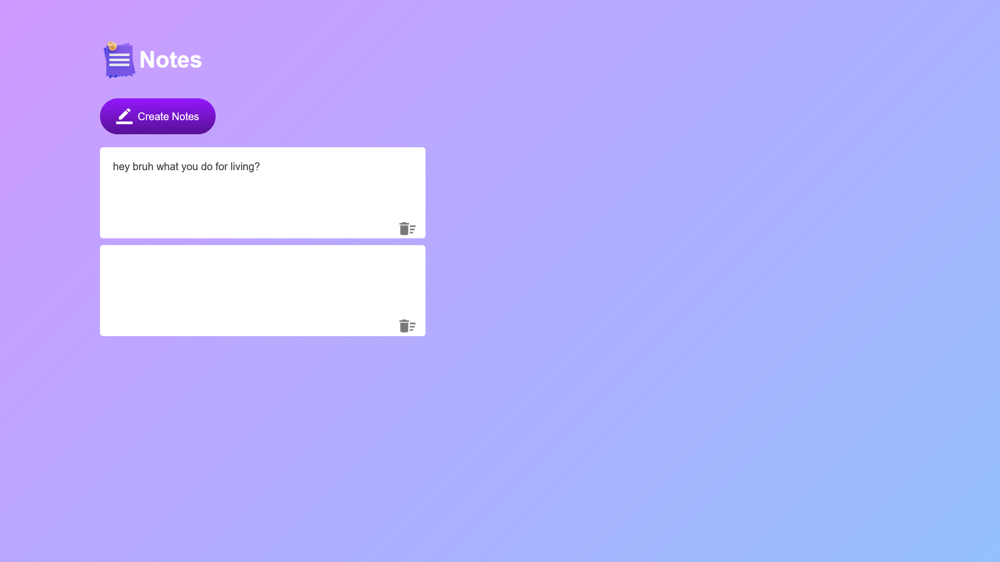
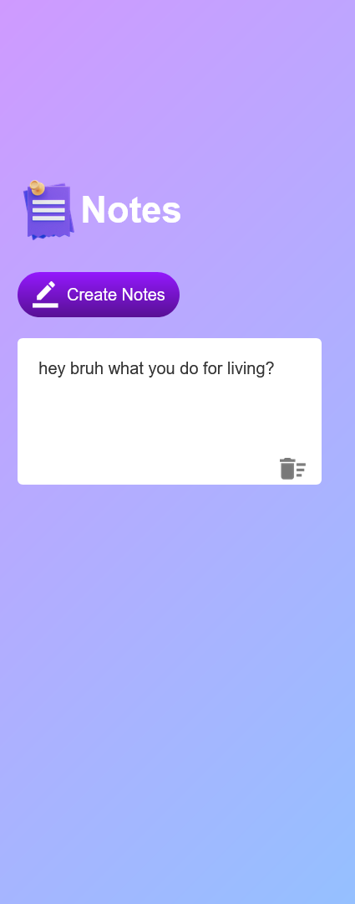

# 05/30 - Notes App

This is a solution to the [QUIZ APP](./index.html).
This is the third project of 30day project challenge.

## Table of contents

- [Overview](#overview)

  - [The challenge](#the-challenge)
  - [Screenshot](#screenshot)
  - [Links](#links)

- [My process](#my-process)

  - [Built with](#built-with)
  - [What I learned](#what-i-learned)
  - [Continued development](#continued-development)

- [Author](#author)
- [Acknowledgments](#acknowledgments)

---

## Overview

### The challenge

Users should be able to:

- Choose one option among 4.
- View correct option even after choosing a wrong answer.

### Screenshot

#### Desktop Design



#### Mobile Design



### Links

- **Solution URL:** [https://github.com/javascript/quiz-app/](https://github.com/javascript/notes-app/)
- **Live Site URL:** [https://ftsomesh.github.io/javascript/notes-app/index.html]([https://ftsomesh.github.io/javascript/notes-app/index.html)

---

## My process

### Built with

- **Semantic HTML5** markup
- **CSS custom properties**
- **Mobile-first** workflow
- **JavaScript** functions
- **localStorage** getItem, setItem

---

### What I learned

This project helped me strengthen my understanding of **localStorage** and **how to show a default message**.

Some specific learnings include:

```css
/* Using word-wrap: break-word, i can prevent long words e.g. aaaaaaaaaaaaaaaaaaaaaaaaaaaaaaa to break on end of the width.*/
.input-box {
  word-wrap: break-word;
}
```

And a neat HTML and JavaScript snippet I’m proud of:

```html
<button id="create-btn" onclick="addNotes()">
  Create Notes
</button>
```

```js
function showNotes() {
  let data = localStorage.getItem("data");

  if (!data || data.trim() === "") {
    // Create default note and store it immediately
    data = `
      <div class="input-box-container">
        <p class="input-box" contenteditable="true">
          Welcome to the Notes App !
        </p>
        
      </div>
    `;
    localStorage.setItem("data", data);
  }

  notesContaier.innerHTML = data;
}
```

---

### Continued development

In future projects, I’d like to:

- Focus more on **UI DESIGN**
- Experiment more with buttons.
- Focus more on **accessibility** and better **UI DESIGN**.
- Calender, Title and Time Features.

---

## Author

- **Website:** [Somesh Sahu](https://ftsomesh.github.io/somesh2hsl)
- **Frontend Mentor:** [@ftsomeshh](https://www.frontendmentor.io/profile/ftsomeshh)
- **Twitter:** [@ftsomeshh](https://www.twitter.com/ftsomeshh)

---

## Acknowledgments

A big thanks to **Great Stack** for the challenge design.

---
