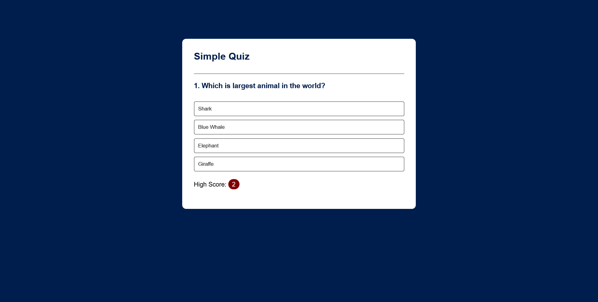
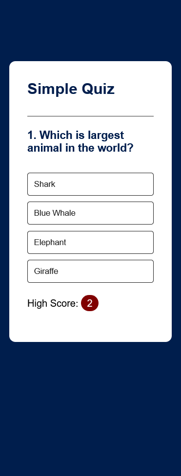

# 03/30 - Quiz App

This is a solution to the [QUIZ APP](./index.html).
This is the third project of 30day project challenge.

## Table of contents

* [Overview](#overview)

  * [The challenge](#the-challenge)
  * [Screenshot](#screenshot)
  * [Links](#links)
* [My process](#my-process)

  * [Built with](#built-with)
  * [What I learned](#what-i-learned)
  * [Continued development](#continued-development)
* [Author](#author)
* [Acknowledgments](#acknowledgments)

---

## Overview

### The challenge

Users should be able to:

* Choose one option among 4.
* View correct option even after choosing a wrong answer.

### Screenshot

#### Desktop Design



#### Mobile Design



### Links

* **Solution URL:** [https://github.com/javascript/quiz-app/](https://github.com/javascript/quiz-app/)
* **Live Site URL:** [https://ftsomesh.github.io/javascript/quiz-app/index.html]([https://ftsomesh.github.io/javascript/quiz-app/index.html)

---

## My process

### Built with

* **Semantic HTML5** markup
* **CSS custom properties**
* **Mobile-first** workflow
* **JavaScript** functions

---

### What I learned

This project helped me strengthen my understanding of **functions** and **dom manipulation**.

Some specific learnings include:

```css
/* Using text-align: center for centering block contents with 100% width. I knew the basic use of centering texts, i just didn't know it centers images, inside block level elements too. */
.btn {
      transition: background-color 0.3s, color 0.4s;
}
.high-score-container {
    margin-block: 20px;

    .high-score {
        border-radius: 20px;
        display: inline-block;
        background: maroon;
        padding: 4px 10px;
        color: #fff;
    }
}


```

And a neat HTML and JavaScript snippet I’m proud of:

```html
<div id="answer-buttons">
    <button class="btn">Answer1</button>
    <button class="btn">Answer2</button>
    <button class="btn">Answer3</button>
    <button class="btn">Answer4</button>
</div>
```

```js
if (localStorage.getItem("high-score") !== null) {
    highScore.innerHTML = localStorage.getItem("high-score");
    }
if (answer.correct) {
    button.dataset.correct = answer.correct
}
```

---

### Continued development

In future projects, I’d like to:

* Add **automatic** skip to next question after a definite delay.
* Experiment more with functions.
* Focus more on **accessibility** and better **UI DESIGN**.
* Timer Feature.

---

## Author

* **Website:** [Somesh Sahu](https://ftsomesh.github.io/somesh2hsl)
* **Frontend Mentor:** [@ftsomeshh](https://www.frontendmentor.io/profile/ftsomeshh)
* **Twitter:** [@ftsomeshh](https://www.twitter.com/ftsomeshh)

---

## Acknowledgments

A big thanks to **Great Stack** for the challenge design.

---
