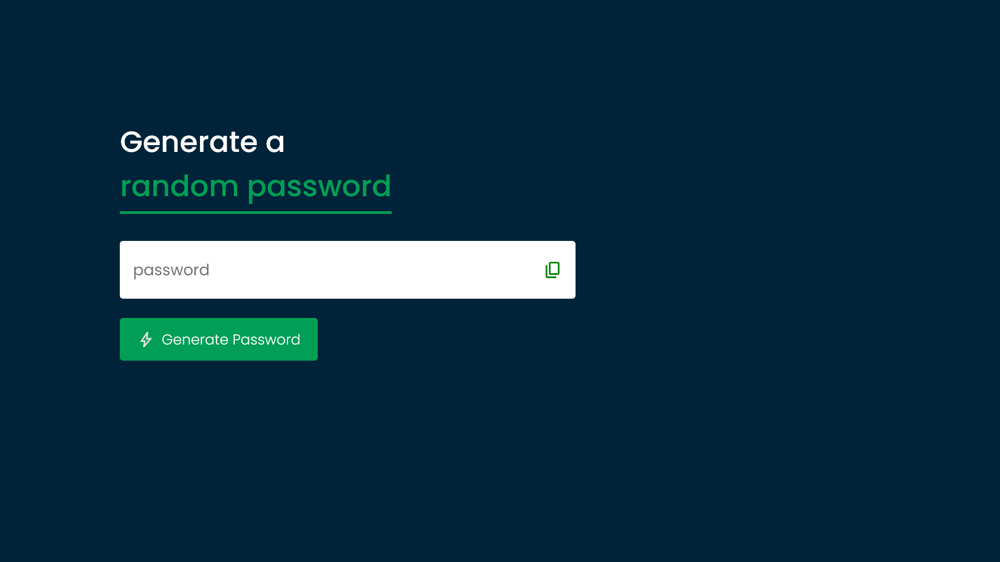

# 04/30 - Weather App

This is a solution to the [QUIZ APP](./index.html).
This is the fourth project of 30day project challenge.

## Table of contents

* [Overview](#overview)

  * [The challenge](#the-challenge)
  * [Screenshot](#screenshot)
  * [Links](#links)
* [My process](#my-process)

  * [Built with](#built-with)
  * [What I learned](#what-i-learned)
  * [Continued development](#continued-development)
* [Author](#author)
* [Acknowledgments](#acknowledgments)

---

## Overview

### The challenge

Users should be able to:

* Create random passwords by clicking on a button.
* Copy password by clicking an icon.
* The min password length is 4, and it should contain one char, one num, one symbol.

### Screenshot

#### Desktop Design



#### Mobile Design


### Links

* **Solution URL:** [https://github.com/javascript/random-password-generator/](https://github.com/javascript/quiz-app/)
* **Live Site URL:** [https://ftsomesh.github.io/javascript/random-password-generator/index.html]([https://ftsomesh.github.io/javascript/random-password-generator/index.html)

---

## My process

### Built with

* **Semantic HTML5** markup
* **CSS custom properties**
* **Desktop-first** workflow
* **JavaScript** functions and **asynchronous codes**

---

### What I learned

This project helped me strengthen my understanding of **Math.random()** and **while** loops.

Some specific learnings include:

And a neat HTML and JavaScript snippet I’m proud of:

```html
<element>
    <input>
    <svg></svg>
</element>
```

```js
function copyText() {
    navigator.clipboard.writeText(passwordBox.value)
        .then(() => {
            clipboardSvg.innerHTML = `
        <path d="M360-240q-33 0-56.5-23.5T280-320v-480q0-33 23.5-56.5T360-880h360q33 0 56.5 23.5T800-800v480q0 33-23.5 56.5T720-240H360ZM200-80q-33 0-56.5-23.5T120-160v-560h80v560h440v80H200Z"/>
        `
            setTimeout(() => {
                clipboardSvg.innerHTML = `
                <path
                    d="M360-240q-33 0-56.5-23.5T280-320v-480q0-33 23.5-56.5T360-880h360q33 0 56.5 23.5T800-800v480q0 33-23.5 56.5T720-240H360Zm0-80h360v-480H360v480ZM200-80q-33 0-56.5-23.5T120-160v-560h80v560h440v80H200Zm160-240v-480 480Z" />
                `
            }, 1000);
            
        })
        
}
```

---

### Continued development

In future projects, I’d like to:

* Add various options for better user experience.
* Add a feature so that users can select the length of the password themselves.
* Experiment more with functions.
* Focus more on **accessibility** and better **UI DESIGN**.
* Timer Feature.

---

## Author

* **Website:** [Somesh Sahu](https://ftsomesh.github.io/somesh2hsl)
* **Frontend Mentor:** [@ftsomeshh](https://www.frontendmentor.io/profile/ftsomeshh)
* **Twitter:** [@ftsomeshh](https://www.twitter.com/ftsomeshh)

---

## Acknowledgments

A big thanks to **Great Stack** for the challenge design.

---
