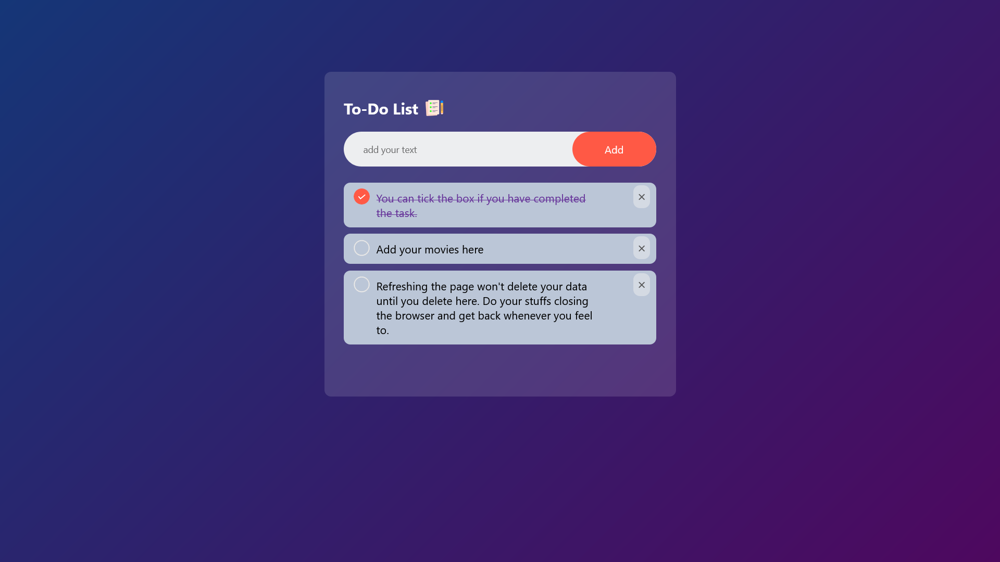
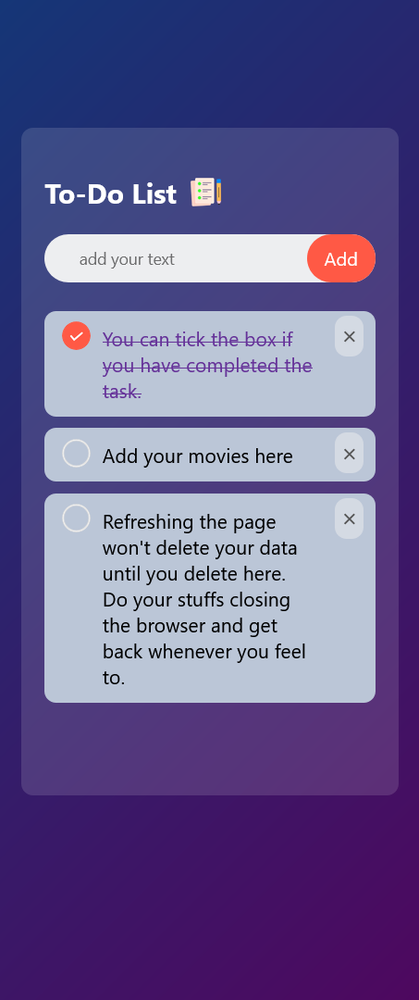

# 02/30 - To-do List

This is a solution to the [To-do List using JavaScript](./index.html).
This is the second project of 30day project challenge.

## Table of contents

* [Overview](#overview)

  * [The challenge](#the-challenge)
  * [Screenshot](#screenshot)
  * [Links](#links)
* [My process](#my-process)

  * [Built with](#built-with)
  * [What I learned](#what-i-learned)
  * [Continued development](#continued-development)
* [Author](#author)
* [Acknowledgments](#acknowledgments)

---

## Overview

### The challenge

Users should be able to:

* Add tasks to the container.
* Remove tasks
* View data even after a hard refresh.
* View the optimal layout for the component depending on their device's screen size

### Screenshot

#### Desktop Design



#### Mobile Design



### Links

* **Solution URL:** [https://github.com/javascript/weather-app/](https://github.com/javascript/todo-list-js/)
* **Live Site URL:** [https://ftsomesh.github.io/javascript/todo-list-js/index.html]([https://ftsomesh.github.io/javascript/todo-list-js/index.html)

---

## My process

### Built with

* **Semantic HTML5** markup
* **CSS custom properties**
* **Desktop-first** workflow
* **Responsive design** with less media queries
* **Gradient backgrounds** and subtle opacity for a clean modern look
* **To-do List** for tasks management

---

### What I learned

This project helped me strengthen my understanding of **DOM** and **.remove()** method.

Some specific learnings include:

```css
/* Using text-align: center for centering block contents with 100% width. I knew the basic use of centering texts, i just didn't know it centers images, inside block level elements too. */
ul li span#cross {
    line-height: 32px;
    color: rebeccapurple;
}

ul li.checked #task-content {
    text-decoration: line-through;
 }


```

And a neat HTML snippet I’m proud of:

```html

<li class="checked"><span id="task-content">You can tick the box if you have completed the task.</span><span id="cross">×</span></li>
<li><span id="task-content">Add your movies here</span><span id="cross">×</span></li>
<li><span id="task-content">Refreshing the page won't delete your data until you delete here. Do your stuffs closing the browser and get back whenever you feel to.</span><span id="cross">×</span></li>

```

---

### Continued development

In future projects, I’d like to:

* Add **react** features with more buttons such as **edit, sheduled task, etc.**.
* Experiment more with APIs.
* Focus more on **accessibility** and better **UI DESIGN**.

---

## Author

* **Website:** [Somesh Sahu](https://ftsomesh.github.io/somesh2hsl)
* **Frontend Mentor:** [@ftsomeshh](https://www.frontendmentor.io/profile/ftsomeshh)
* **Twitter:** [@ftsomeshh](https://www.twitter.com/ftsomeshh)

---

## Acknowledgments

A big thanks to **Great Stack** for the challenge design.

---
