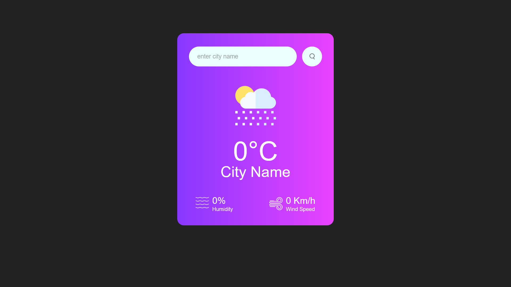
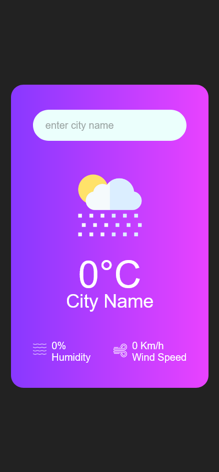

# 01/30 - Weather App

This is a solution to the [Weather App using API challenge](./index.html).
This is the first project of 30day project challenge.

## Table of contents

* [Overview](#overview)

  * [The challenge](#the-challenge)
  * [Screenshot](#screenshot)
  * [Links](#links)
* [My process](#my-process)

  * [Built with](#built-with)
  * [What I learned](#what-i-learned)
  * [Continued development](#continued-development)
* [Author](#author)
* [Acknowledgments](#acknowledgments)

---

## Overview

### The challenge

Users should be able to:

* View the optimal layout for the component depending on their device's screen size
* View weather by city names

### Screenshot

#### Desktop Design



#### Mobile Design



### Links

* **Solution URL:** [https://github.com/javascript/weather-app/](https://github.com/javascript/weather-app/)
* **Live Site URL:** [https://ftsomesh.github.io/javascript/weather-app/index.html]([https://ftsomesh.github.io/javascript/weather-app/index.html)

---

## My process

### Built with

* **Semantic HTML5** markup
* **CSS custom properties**
* **Flexbox** for layout
* **Desktop-first** workflow
* **Responsive design** with media queries
* **Gradient backgrounds** and subtle shadows for a clean modern look
* **Weather App Api** for weather access

---

### What I learned

This project helped me strengthen my understanding of **asynchronous programming** and **api integration**.

Some specific learnings include:

```css
/* Using text-align: center for centering block contents with 100% width. I knew the basic use of centering texts, i just didn't know it centers images, inside block level elements too. */
.card {
      text-align: center;
}


```

And a neat HTML snippet I’m proud of:

```html
<input type="text" placeholder="enter city name" autofocus list="citynames">
      <datalist id="citynames">
      <option value="odisha"></option>
      <option value="australia"></option>
      <option value="angul"></option>
</datalist>
```

---

### Continued development

In future projects, I’d like to:

* Add **automatic** location detection and show the user's weather by default.
* Experiment more with APIs.
* Focus more on **accessibility** and better **UI DESIGN**.

---

## Author

* **Website:** [Somesh Sahu](https://ftsomesh.github.io/somesh2hsl)
* **Frontend Mentor:** [@ftsomeshh](https://www.frontendmentor.io/profile/ftsomeshh)
* **Twitter:** [@ftsomeshh](https://www.twitter.com/ftsomeshh)

---

## Acknowledgments

A big thanks to **Great Stack** for the challenge design.

---
